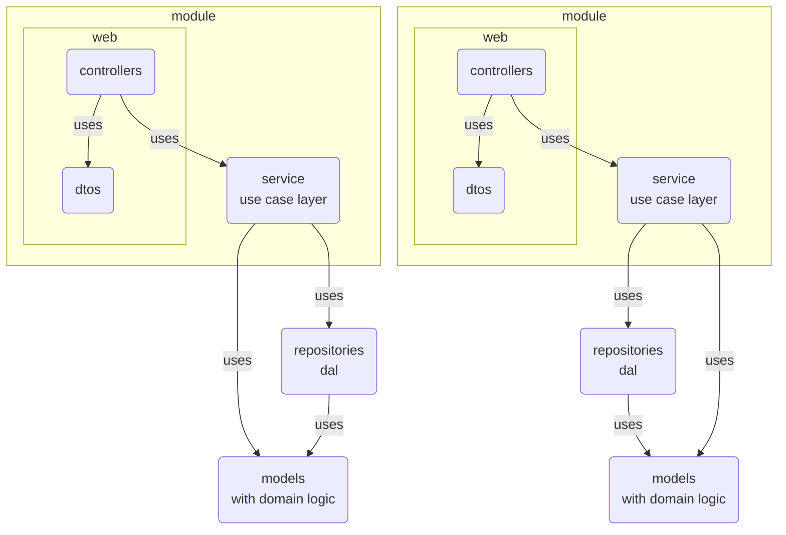

## Description
This is an example that was inspired by Vlad Kononov's book **[Learning DDD](https://learning.oreilly.com/library/view/learning-domain-driven-design/9781098100124/)**. This is an attempt to make a small piece with a layered architecture and Active Recording.


## Schema


## Installation

```bash
$ npm install
```

## Running the app

```bash
# development
$ npm run start

# watch mode
$ npm run start:dev

# production mode
$ npm run start:prod
```

## Test

```bash
# unit tests
$ npm run test

# e2e tests
$ npm run test:e2e

# test coverage
$ npm run test:cov
```
